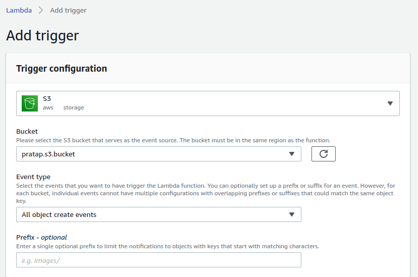
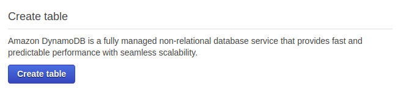
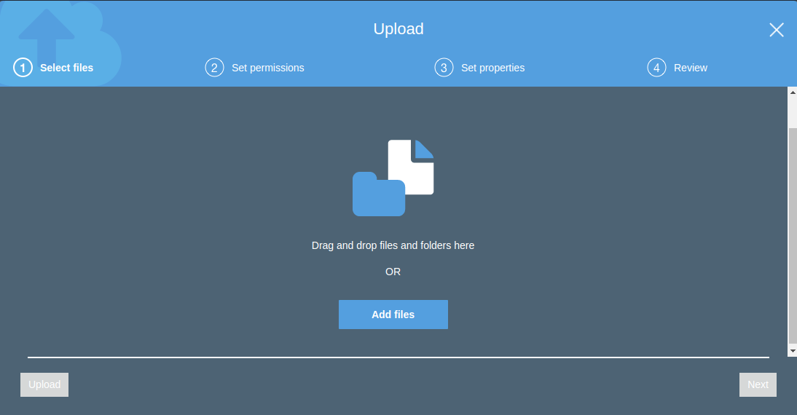

Go to the Services-->IAM-->Role and ***Create Role*** for **Lambda** in common used cases
 

Then again go into services-->DynamoDB and search for ***DynamoDB Full Access***

Provide Role name whatever you want

Here our Role is ready of named ***lambda-for-dynamodb***

Go again into Services-->Lambda

Create a Function

Provide resspective details and select ***Use existing role*** because we have created our role earlier

Here our Lambda Function created

Go towards down into the page and put your code their here I'm using ***Edit code inline***

This is our code 

Now we need to create an AWS S3 Bucket to add trigger
Go to the Services-->S3

Here I create my S3 Bucket of named ***pratap.s3.bucket***

Now if we go on to **Add trigger** in our Lambda we get the S3 option 

Here in trigger section I choosed ***All object create event*** it basically fire trigger in every situation
***Note-:*** Trigger must be checked as Enabled

Now time to create **DynamoDB** in services-->DynamoDB

Create Table as named you choose in your Python Code and also with Primary key as same as in Python Code
In my case I take myTable as Table name and uniqueID as Primary Key

Here our Table is created 

Now we need to upload any type of file in our S3 bucket to test that our lambda is working or not
So here i uploaded my two of files 

Now go to the DynamoDB and select Table and choose your table name-->Item
**And The BAR IS SET!**
You can see every details of your data like type of file, put/post/get, size etc.

### Contributors
[![Yogendra Pratap Singh][yogendra_avatar]][yogendra_homepage] [Yogendra Pratap Singh][yogendra_homepage] 

  [yogendra_homepage]: https://github.com/PratapSingh13
  [yogendra_avatar]: https://img.cloudposse.com/75x75/https://github.com/PratapSingh13.png
