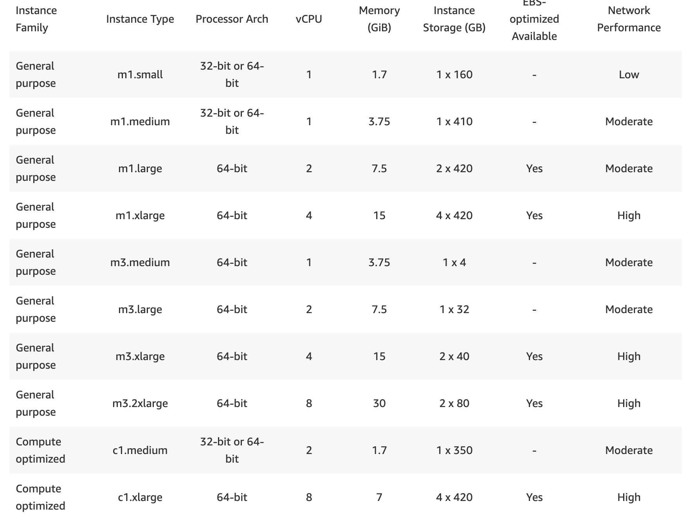
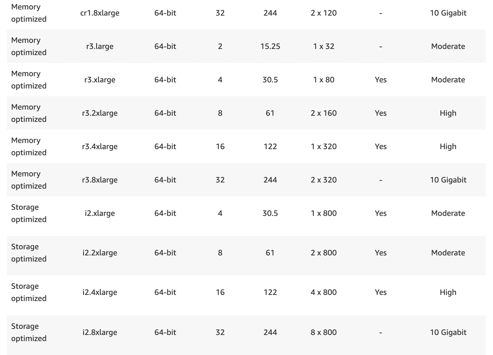

# What is EC2

EC2 stands for *Elastic Compute Cloud* 

- Amazon EC2 provides **Scalable** computing capacity in AWS cloud which means you can create a server for completely your choice like if you want to have a server with 4GB RAM and 100GB memory EC2 gives complete functionality for your need.

- Using Amazon EC2 it eliminates your need to invest in hardware upfront, so you can develop and deploy the application faster.

- You can use Amazon EC2 to launch as many or as few virtual servers as you need, configure security, networking and manage storage.

- Amazon EC2 enables you scale up or scale down the instances which means suppose you are using a small server for your application but in future you feel that traffic is getting more and more into your application so instead createation of another new server you just need to increase the capacity of existing server that's it and it cost you less.

- For billing luckily it uses *pay per second* or *pay per minute* .

- Amazon EC2 is having two storage options for their root volume-
    1. EBS (Elastic Block Storage)
    2. Instance store

- Pre-Configured templates are available name Amazon Machine Image or AMI.

- By default, when you create an EC2 account with Amazon your account is just limited to a maximum of **20 instances per EC2 region** with 2 default **High I/O instances**. But if you want to have more then you need to drop a request msg to Amazon team.

## Types of EC2 Instances
1. General Purpose - Balanced memory and CPU.
2. Compute Optimised - More CPU than RAM like if you want 4-Core or 8-Core CPU.
3. Memory Optimised - More RAM.
4. Accelerated Computing - Graphics Optimised for gaming or ML related work.
5. Storage Optimised - Low latency
6. High Memory Optimised - More RAM, Nitro System.
(Nitro System is a kind of specialised HyperVisor which uses for virtualization  it helps to use resources very intelligently and make very low latency due to it increases RAM performance also increase throughput)

**For detail**

**Amazon added two new types of instances**
1. Amazon EC2 High Memory Instances
2. Amazon EC2 Previous Generation Instances

### Amazon EC2 High Memory Instances
EC2 High Memory instances offer 6, 9, 12, 18, and 24 TB of memory in an instance. These instances are purpose-built to run large in-memory databases, including production deployments of the SAP HANA in-memory database, in the cloud. EC2 High Memory instances allow you to run large in-memory databases and business applications that rely on these databases in the same, shared Amazon Virtual Private Cloud (VPC), reducing the management overhead associated with complex networking and ensuring predictable performance.

### Amazon EC2 Previous Generation Instances
AWS offers Previous Generation Instances for users who have optimized their applications around these instances and have yet to upgrade. Previous Generation Instances are still fully supported and retain the same features and functionality. Previous Generation Instances are available through the AWS Management Console, AWS CLI, and EC2 API tools.

### Contributors
[![Yogendra Pratap Singh][yogendra_avatar]][yogendra_homepage] [Yogendra Pratap Singh][yogendra_homepage] 

  [yogendra_homepage]: https://github.com/PratapSingh13
  [yogendra_avatar]: https://img.cloudposse.com/75x75/https://github.com/PratapSingh13.png