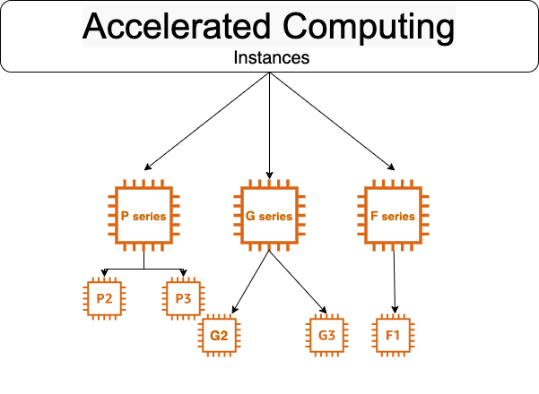

# What is Accelerated Computing Instances

Accelerated Computing Instance family uses hardware, accelerator, or co-proccessors to perform some functions such as floating point number calculation, graphics pattern or data pattern matching more effectively than is possible in software running on CPU.

## Instances available in 3 types
1. P-series
2. G-series
3. F-series

## F1 instance

- F1 instances offers customizable hardware acceleration with **Field Programmable Gate Arrays** (FPGA).

- FPGA is used on basically digital cameras DSLRs processors which helps on digital signal processing very fast.

- Each FPGA contains 2.5 million Logic elements and 6800 DSP engines.

- Designed to accelerate computationally intensive algorithms such as data flow or high parallel options.

**It has following configuration:**

**vCPU -** min 8 to max 64

**FPGA -** min 1 to max 8

**RAM -** min 122GB to max 976 GB

**Instance Storage -** NVMe SSD

**Instances are well suited for following for:**
- Genomics Research
- Real time video processing (like Facebook Live)
- Financial analytics

## P2 & P3 instances
- It uses Nvidia Tesla GPU.
- Provide high bandwith networking.
- Upto 32GB of memory per GPU which means that it is ideal for Deep Learning & Computational Fluid Dynamics.

**Instances are well suited for following for:**
- Machine Learning
- AI
- Deep Learning
- Seismic analysis
- Molecular Modeling
- Genomic Study

| **Specification** |  **P2** |  **P3**  |
| :-----: | :--: | :--: |
| vCPU    | 4 to 64 | 8 to 96 |
| GPU     | 1 to 16 | 1 to 8  |
| RAM     | 61GB to 732GB | 61GB to 768GB |
| GPU RAM | 12GB to 192GB | 8GB to 12GB |
|  Network Bandwith | 25Gbps | 10Gbps | 

**Note -:** P3 supports **CUDAB** & **OpenCI** API while P2 supports **CUDAB** & **OpenCI 1.2**.

## G2 & G3 instances
- These types of instances are optimised for Graphics intensive application

- Well suited for app like **3D Visualization** 

- G3 instances use **NVIDIA TESLA M60 GPU** and provides a cost effective high performance platform for graphics  applications.

**It has following configuration:**

**vCPU -** min 4 to max 64

**GPU -** min 1 to max 4

**RAM -** min 305GB to max 488 GB

**GPU RAM -** min 8GB to 32GB
**Network Bandwith -** 25Gbps

**Instances are well suited for following for:**
- Video Creation services
- 3D Visualization 

### Contributors
[![Yogendra Pratap Singh][yogendra_avatar]][yogendra_homepage] [Yogendra Pratap Singh][yogendra_homepage] 

  [yogendra_homepage]: https://github.com/PratapSingh13
  [yogendra_avatar]: https://img.cloudposse.com/75x75/https://github.com/PratapSingh13.png