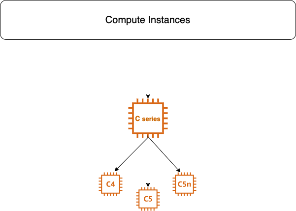

# What is Compute Optimised Instances

Compute Optimised instances are ideal for **compute-bound** (In a timeframe it gives as much as possible output) applications that benefits from high performance processors. 

## Instances available in 3 types
- c4
- c5
- c5n

**Note-:** c3 replaced by c5 and now c3 is a *Previous Generation Instance*.

## c4 Instances
c4 instances are optimized for compute intensive workloads and deliver very cost effective high performance at low price per compute ratio.

**It has following configuration:**

**vCPU -** min 2 to max 36

**RAM -** min 3.75GB to max 60GB

**Instance Storage -** EBS only

**Network Bandwith -** upto 10Gbps

**Instances are well suited for following for:**
- WebServers
- Batch Processing 
- MMO Gaming
- Video Encoding

## c5 Instances
c5 instances are optimized for compute intensive workloads and deliver very cost effective high performance at low price per compute ratio.
Difference between c4 and c5 is it supports AWS Nitro system (Nitro is a hypervisor which is very fast and very effective).

**It has following configuration:**

**vCPU -** min 2 to max 72

**RAM -** min 4GB to max 192GB

**Instance Storage -** EBS and NVMe SSD

**Network Bandwith -** upto 25Gbps

**Instances are well suited for following for:**
- High Performance WebServers
- Gaming
- Video Encoding

**Important -:**
- c5 supports max 25 EBS volumes
- c5 use Elastic Network Adapter
- c5 uses new Hypwervisor named Nitro

### Contributors
[![Yogendra Pratap Singh][yogendra_avatar]][yogendra_homepage] [Yogendra Pratap Singh][yogendra_homepage] 

  [yogendra_homepage]: https://github.com/PratapSingh13
  [yogendra_avatar]: https://img.cloudposse.com/75x75/https://github.com/PratapSingh13.png