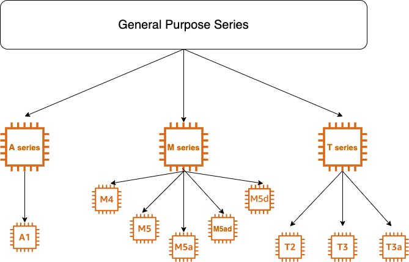

# What is General Purpose Instances

General Purpose Instances provides a **balance** of *compute, memory and networking* resources

## Instances available in 4 sizes
- Nano (T-series)
- Small (T-series)
- Medium (A-series, M-series, T-series)
- Large (A-series, T-series)
