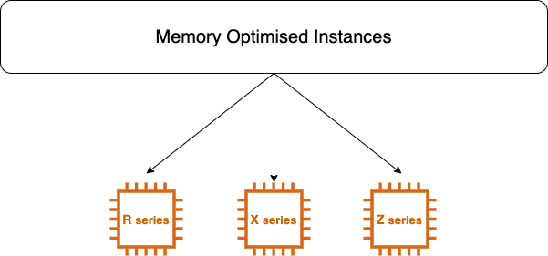

# What is Memory Optimised Instances

Memory Optimised Instances are designed to deliver fast performance for workloads tha process large data set in memory.

Whenever you are working on large database and for that it needs huge RAM for data processing so we need to take Memory Optimised Instances.

## Instances available in 3 types
1. R-series
2. X-series
3. Z-series

## R4 R5 R5a R5ad R5d Instances
- Uses for High performance, Relational(mySQL) and NoSQL(MongoDB, Cassandra) databases.
- Distributed web scale cache stores that provide  in memory caching of key value type data. (Process the data in run time using cache memory)

**Instances are well suited for following for:**
- Financial System
- Hadoop

**It has following configuration:**

**vCPU -** min 2 to max 96

**RAM -** min 16GB to max 768GB

**Instance Storage -** EBS only and NVMe SSD

## X1 X1e Instances
- Well suited for high performance database, memory extensive enterprise applications, Relational Database workload and SAP HANA.

- Electronic design automation.

**It has following configuration:**

**vCPU -** min 4 to max 128

**RAM -** min 122GB to max 3904GB

**Instance Storage -** NVMe SSD

## Z1d nstance 
*The fastest in any cloud instance*

- High frequency Z1d delivers a sustained all core frequency of **4.0GHz**
- It uses AWS Nitro system Xeon processor, upto 1.8TB of instance storage.

**Instances are well suited for following for:**
- Electronic Design
- Automation

**It has following configuration:**

**vCPU -** min 2 to max 48

**RAM -** min 16GB to max 384GB

**Instance Storage -** NVMe SSD

### Contributors
[![Yogendra Pratap Singh][yogendra_avatar]][yogendra_homepage] [Yogendra Pratap Singh][yogendra_homepage] 

  [yogendra_homepage]: https://github.com/PratapSingh13
  [yogendra_avatar]: https://img.cloudposse.com/75x75/https://github.com/PratapSingh13.png