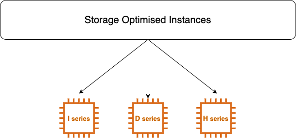

# What is Storage Optimised Instances

Storage Optimised Instances are designed for workloads that require high **sequential read and write access** to very large data sets on the local storage.

In real world example Storage Optimised Instances are taken on use for Music or Video websites for upload and download.

They are optimised to deliver tens of thousands of low latency random I/O operations per second (IOPS) to application.

## Instances available in 3 types
1. I-series
2. D-series
3. H-series

## D2 instances
D2 instances are known as Dense storage instances.
 
**Instances are well suited for following for:**
- Massive Parallel Processing (MPP) data warehouse.
- Map Reduce and Hadoop distributed omputing.
- Log or data processing app.

**It has following configuration:**

**vCPU -** min 4 to max 36

**RAM -** min 30.5GB to max 244GB

**Instance Storage -** NVMe SSD

## H1 instances
This family features upto 16TB of HDD based local storage, high disk throughput and balance of compute and memory.

**Instances are well suited for following for:**
- Application requiring sequential access to large amount of data and direct attached instance storage. **(Direct attached storage means the storage which attached with that server while EBS is network attached storage because EBS storage is retrieved from another place using network).**

- Application that requires high throughput access to large quqntities of data.

**It has following configuration:**

**vCPU -** min 8 to max 64

**RAM -** min 32GB to max 256GB

**Instance Storage -** HDD

## I3 and I3en instances
**Instances are well suited for following for:**
- High frequency **Online Transaction Processing** System (OLTP).
- Relational Database (Like-Gmail)
- No SQL Database
- Distributed file System ()
- Data warehousing application (Facebook, YouTube)

**It has following configuration:**

**vCPU -** min 2 to max 96

**RAM -** min 16GB to max 768GB

**Instance Storage -** NVMe SSD

**Networking Performance -** 25Gbps to 100Gbps

**Sequential Throughput -** 

*Read* - 16GB/s 

*Write* - 6.4GB/s (I3) and 8GB/s (I3en)

**Note -:** GB/s = GigaByte per Second.

### Contributors
[![Yogendra Pratap Singh][yogendra_avatar]][yogendra_homepage] [Yogendra Pratap Singh][yogendra_homepage] 

  [yogendra_homepage]: https://github.com/PratapSingh13
  [yogendra_avatar]: https://img.cloudposse.com/75x75/https://github.com/PratapSingh13.png