# Let's learn how to create VPC and other networking modules

**Step-1.0** Search for VPC in search box

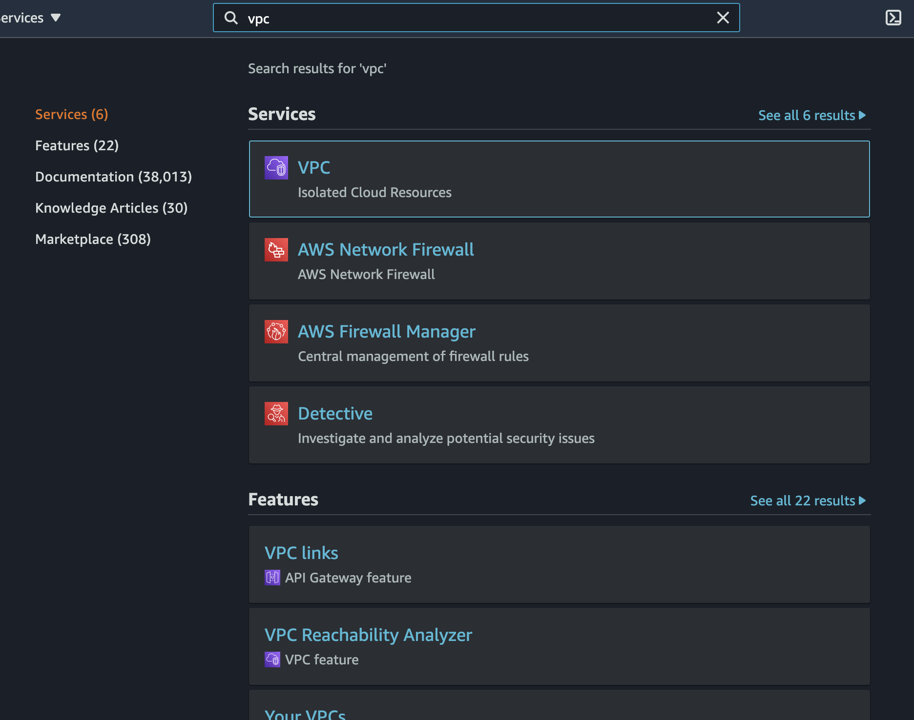

**Step-1.1** Or go to **Services**

In Services you will find **VPC** in **Networking and Content Delivery**

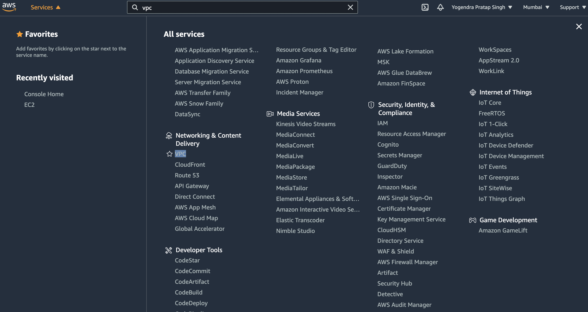

**Step-1.2** Create VPC

Click on **Create VPC**

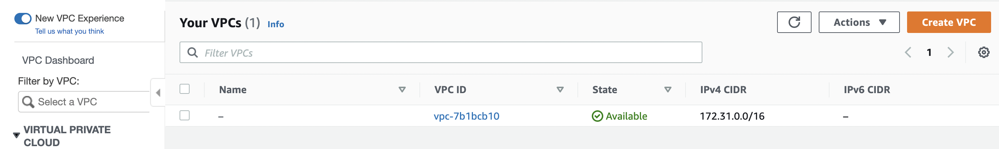

**Step-1.3** Put some details

**Name tag -** Here provide the name for you VPC.

**IPv4 CIDR block -** Give CIDR block for your VPC.

**IPv6 CIDR block -** Keep *No IPv6 CIDR block* .

**Tenancy -** Here you need to provide Tenancy as *dedicated* or *default*. If you choose *dedicated* then it will cost you.

*After all this hit on *Create VPC**.

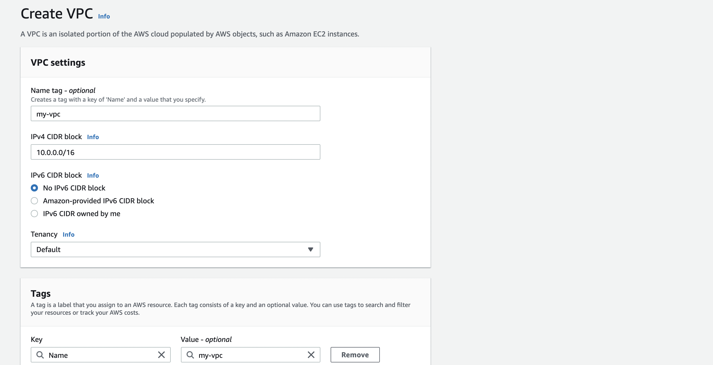

**Step-1.4** Go through to your VPC

Here you will find the *VPC ID* *State* and all state should be *Available*.

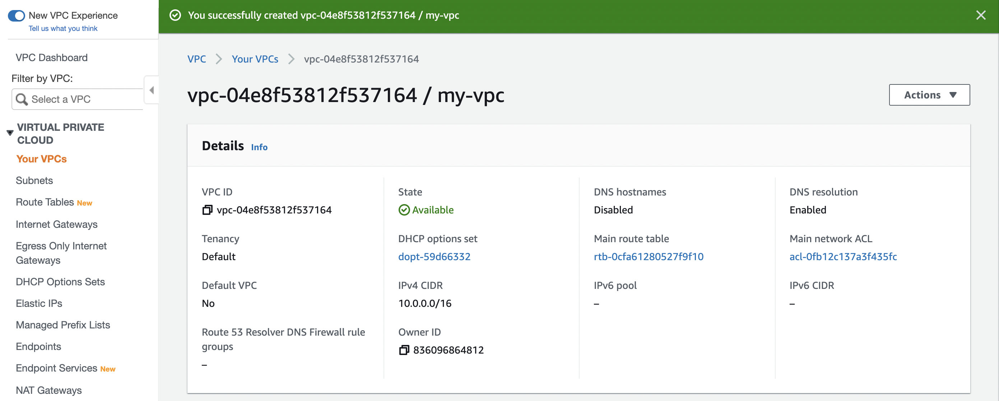

**Step-1.5** Find your VPC

Click on *Your VPCs* and you will find the VPC that you made.

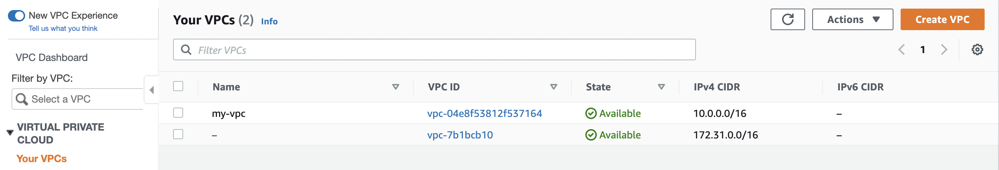

**Step-2.0** Create Subnet

Click on **Subnets** in left pane.

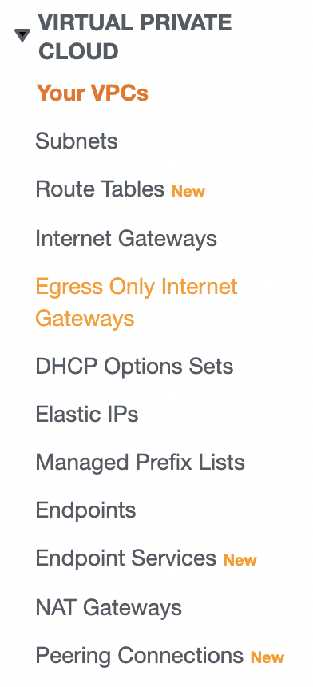

Here if you are creating for first time you will find only default subnets which were provided by AWS itself

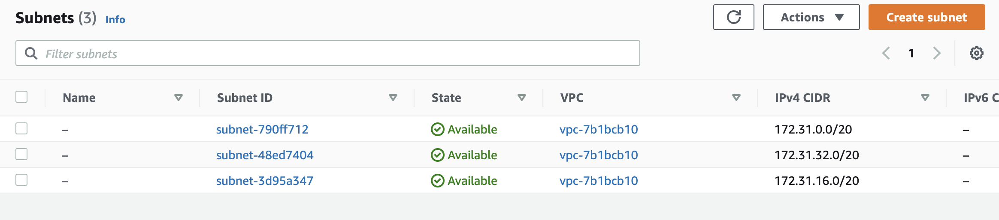

**Step-2.1** Select VPC

Select VPC where you want to create subnets because subnets are VPC associated, you can not use a subnet in different VPC.

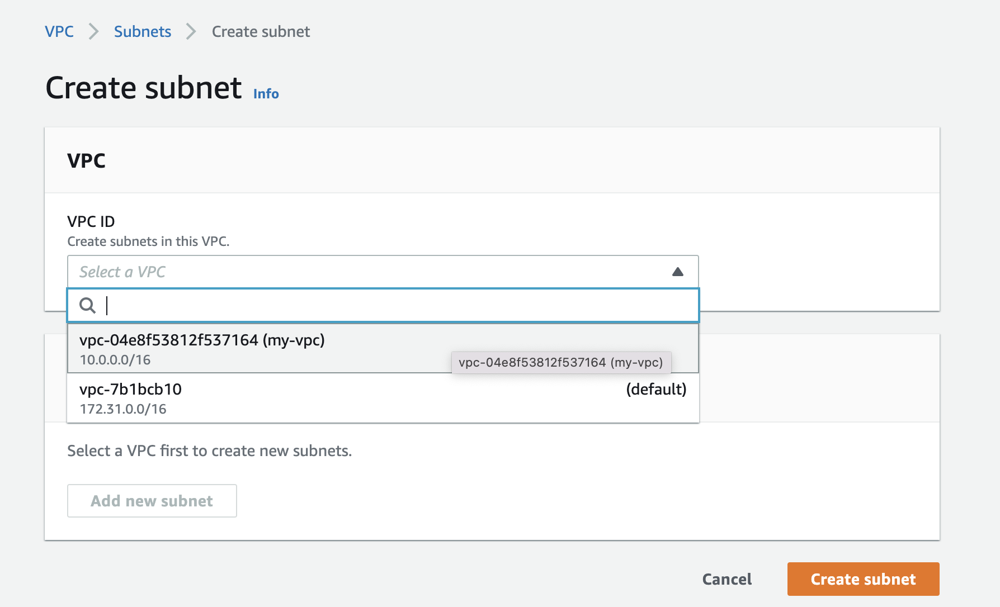

**Step-2.2** Choose **Availability Zone**

Here you need to choose AZ for your subnet

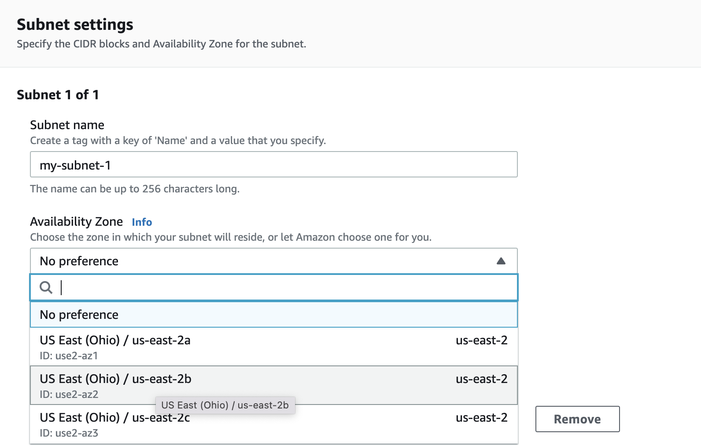

**Step-2.3** Give Subnet CIDR

In this step you need to give subnet CIDR and most important its range should be inside the VPC CIDR.

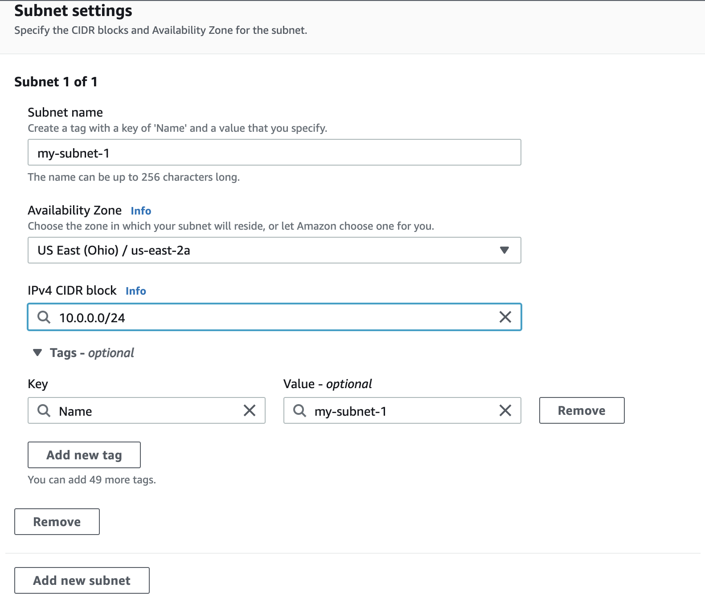

**Step-2.4** Find your Subnet

Here Your Subnet created successfully.

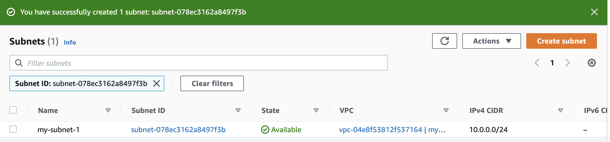

